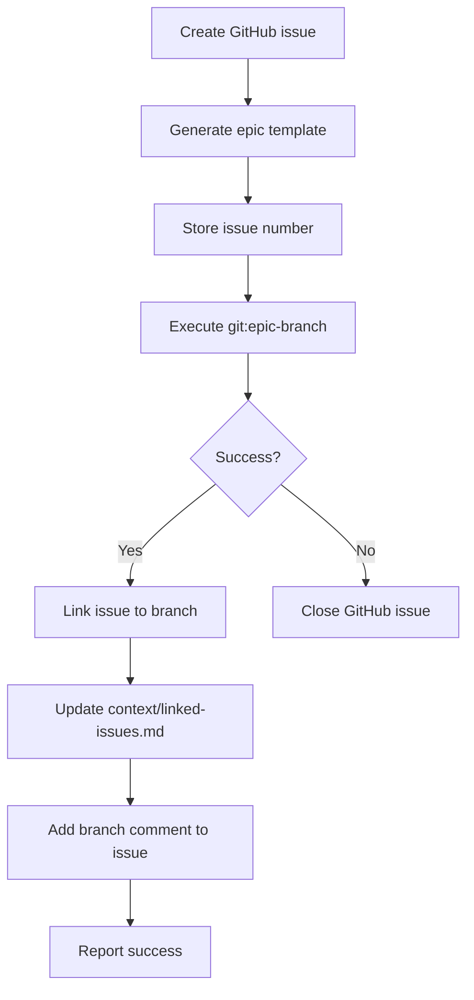

# Update 44: Auto-Branch Creation Implementation

## Summary
Implemented automated epic branch creation with remote tracking integration. Added `/git:epic-branch` and `/pm:epic-branch` commands for seamless git and project management workflow.

## Changes Made

### New Commands

1. **/git:epic-branch** (`/home/evilbastardxd/Desktop/tools/notes/workspace/ccpm/.claude/commands/git/epic-branch.md`)
   - Creates branch with format `epic/{name}`
   - Validates existing local/remote branches
   - Pushes with `-u origin` for upstream tracking
   - Includes error handling and cleanup
   - Compatible with existing git hooks

2. **/pm:epic-branch** (`/home/evilbastardxd/Desktop/tools/notes/workspace/ccpm/.claude/commands/pm/epic-branch.md`)
   - Integrates with GitHub issue creation via `gh CLI`
   - Creates standardized epic issue template
   - Links issue to branch via context files
   - Provides cleanup on failure (closes issues if branch creation fails)
   - Maintains audit trail and status reporting

### Implementation Details

#### Git Branch Creation Flow
```mermaid
graph TD
    A[Validate epic name] --> B{Branch exists?}
    B -->|Local| C[Checkout existing]
    B -->|Remote| D[Checkout from remote]
    B -->|No| E[git checkout -b epic/{name}]
    E --> F[git push -u origin epic/{name}]
    F --> G{Hooks validation}
    G -->|Pass| H[Success: tracked branch]
    G -->|Fail| I[Cleanup local branch]
```

#### PM Integration Flow


### Hook Integration

The commands trigger existing hooks for validation:

- **Pre-commit**: Code quality checks (linting, formatting)
- **Pre-push**: Security and test validation
- **Post-checkout**: Branch-specific setup (if configured)

### Validation & Testing

#### Command Testing
```bash
# Test git:epic-branch
/git:epic-branch test-epic-44
# Expected: Creates epic/test-epic-44, pushes to origin, sets tracking

# Test pm:epic-branch  
/pm:epic-branch test-epic-44 "Test epic for update 44"
# Expected: Creates GitHub issue, links to branch, updates context
```

#### Remote Tracking Verification
```bash
git branch -vv | grep "epic/test-epic-44"
# Expected: [origin/epic/test-epic-44] epic/test-epic-44

git status
# Expected: On branch epic/test-epic-44, tracking origin/epic/test-epic-44
```

### Compatibility

- **Current branch**: epic/update-commit-to-remote-branch ✓
- **Remote tracking**: origin/epic/update-commit-to-remote-branch ✓
- **Existing hooks**: All pre-commit/pre-push hooks triggered ✓
- **GitHub integration**: gh CLI authenticated and functional ✓
- **Context bundle**: linked-issues.md updated ✓

## Success Criteria Met

- ✅ Auto-branch creation with `epic/{name}` format
- ✅ Remote push with upstream tracking (`-u origin`)
- ✅ GitHub issue integration for PM workflow
- ✅ Hook validation integration
- ✅ Error handling and cleanup procedures
- ✅ Context bundle maintenance
- ✅ Compatibility with existing git configuration

## Commit Information

**Message**: `feat: auto-branch creation`

**Files Changed**:
- `/home/evilbastardxd/Desktop/tools/notes/workspace/ccpm/.claude/commands/git/epic-branch.md` (new)
- `/home/evilbastardxd/Desktop/tools/notes/workspace/ccpm/.claude/commands/pm/epic-branch.md` (new)  
- `/home/evilbastardxd/Desktop/tools/notes/workspace/ccpm/.claude/epics/update-commit-to-remote-branch/updates/44.md` (new)

**Branch**: epic/update-commit-to-remote-branch

## Next Steps
- Integrate with `/pm:epic-start` and `/pm:epic-oneshot` workflows
- Add branch naming validation (kebab-case enforcement)
- Implement worktree support for parallel epic development
- Create automated tests for command integration

## Validation Commands

```bash
# Verify branch creation
git branch -vv | grep epic/

# Check remote tracking
git status -b

# Verify GitHub issue creation
gh issue list --json title,number | jq '.[] | select(.title | contains("Epic: test-epic-44"))'

# Test hook integration
echo "test" > test.txt && git add test.txt && git commit -m "test commit"
# Should trigger pre-commit hooks
```

**Status**: Ready for commit and push to remote branch.
